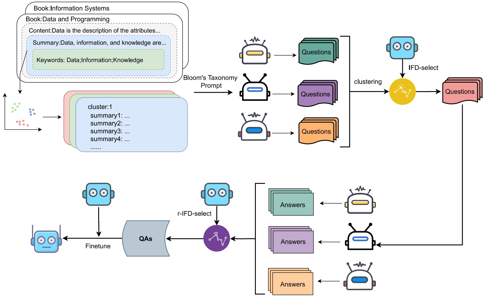

# Book2QA: Enhancing Question-Answering with LLMs

The Book2QA project integrates multiple medium-scale language models to generate high-quality question-answering data from textbooks.


## Features

- **Book Data Preprocessing**: Converts textbook content into a structured format for further processing.
 For the summaries and keywords, we used ChatGPT to generate them. We have saved the processed data in the dataset/book_cluster.json file. The clustering results of the summaries are stored in the clusters.json file, and the code for converting PDF files to JSON files is located in the **data_process** directory.
- **Question Generation and Filtering**: Generates diverse questions using LLMs, followed by filtering to enhance quality.
- **Answer Generation and Filtering**: Produces and refines answers using a fine-tuned model, ensuring relevance and clarity.

## Installation

Clone the repository and install the necessary dependencies:

```bash
git clone https://github.com/Curtain2020/Book2QA
cd Book2QA
pip install -r requirements.txt
```

## Usage

This project consists of several scripts that automate various tasks. The primary scripts included are:

- `run_generate_best_answers.sh`: Generates the best answers using a Python script.
- `run_generation_and_merge.sh`: Generates and merges questions using a Python script.
- `run_ifd_calculation.sh`: Calculates IFD and filters results using a Python script.

### Requirements

This project uses a virtual environment to manage dependencies. All required packages are listed in the `requirements.txt` file. To set up the virtual environment and install all dependencies, please follow the instructions below.
    ```

## Contributing

Contributions to Book2QA are welcome! Please refer to `CONTRIBUTING.md` for more details on how to submit pull requests, report issues, or make feature requests.

## License

This work is licensed under a [Creative Commons Attribution-ShareAlike 4.0 International License](https://creativecommons.org/licenses/by-sa/4.0/).

## Citation

If you use this work in your research, please cite:

```bibtex
@inproceedings{book2qa2024,
  title={Book2QA: A Framework for Integrating LLMs to Generate High-quality QA Data from Textbooks},
  author={Anonymous},
  booktitle={EMNLP},
  year={2024}
}
```

## Acknowledgments

- Thanks to the contributors who have invested their time in improving the Book2QA framework.
